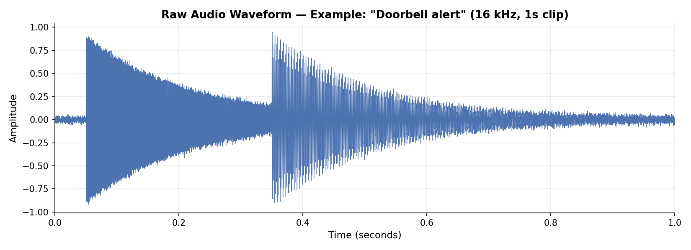
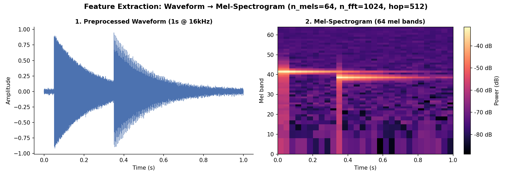
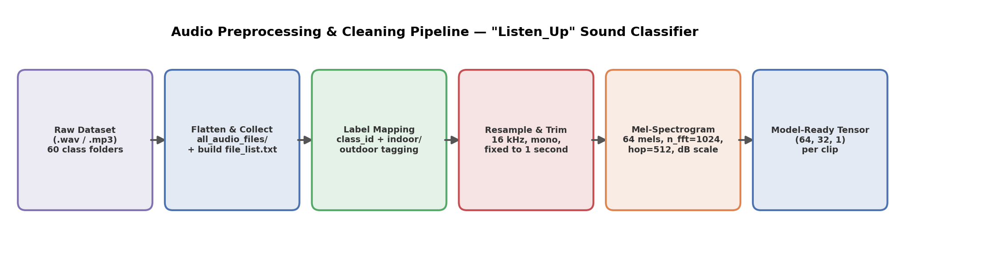
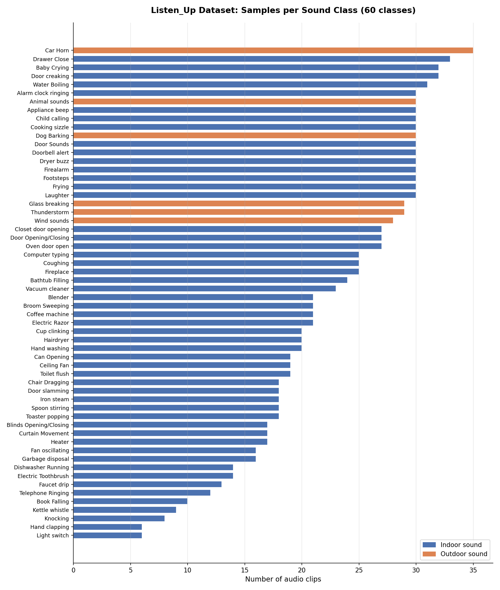
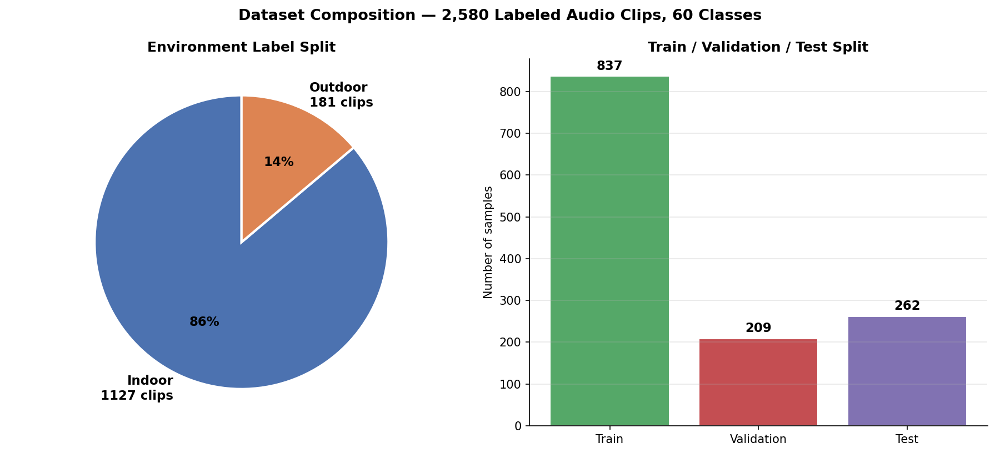
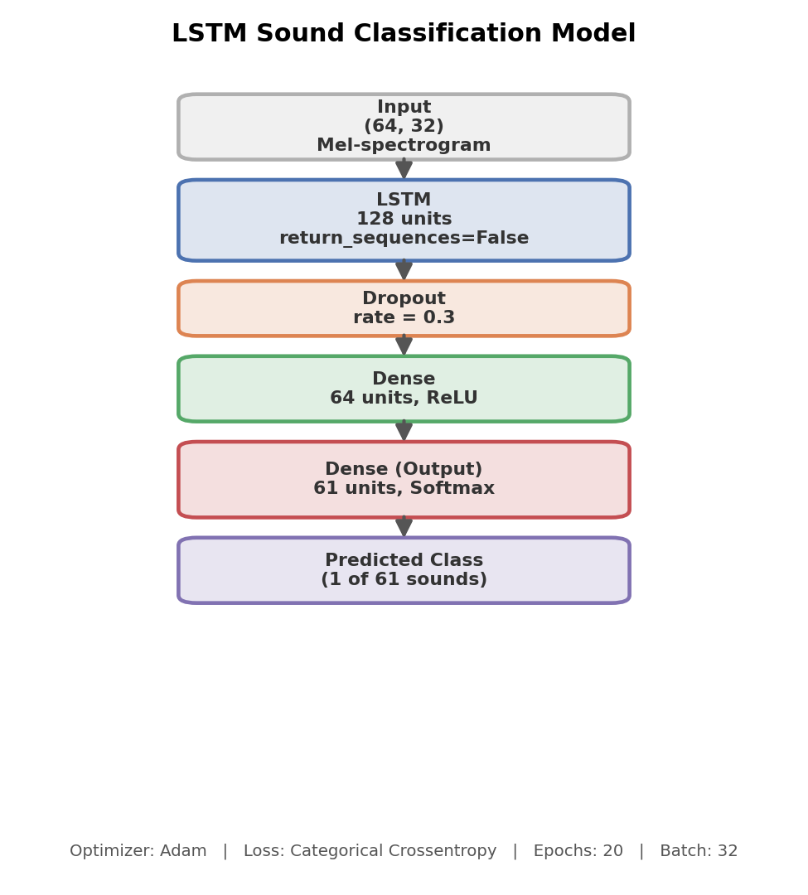
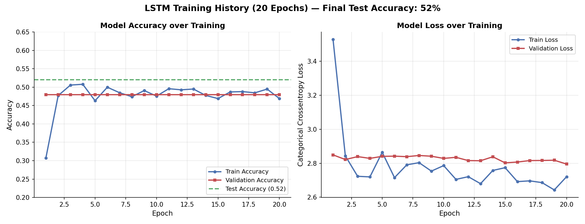

# 🎵 Sound Classification Using YAMNet & LSTM

### Deep Learning-Based Environmental Sound Classification with Transfer Learning

<p align="center">

**YAMNet • LSTM • Audio Processing • Feature Extraction • Deep Learning**

</p>

<p align="center">
  
  
  
  
  
</p>

---

## 📌 Project Overview

This project explores **environmental sound classification using deep learning**.

The implementation combines **audio preprocessing**, **Mel-spectrogram-based feature preparation**, **YAMNet transfer learning**, and an **LSTM classifier** to identify sound categories from audio recordings.

The workflow processes audio files, standardizes them to a fixed format, extracts learned audio representations using **YAMNet**, and uses the processed representations as input to a custom **LSTM-based classification model**.

---

## 🎯 Objectives

The main objectives of this project are to:

* Build an end-to-end environmental audio classification pipeline.
* Preprocess audio into a consistent format suitable for deep learning.
* Extract meaningful audio representations using **YAMNet**.
* Develop an **LSTM-based classifier** for multi-class sound classification.
* Encode and classify multiple environmental sound categories.
* Validate important components of the machine learning pipeline.
* Evaluate the trained classifier on unseen test data.

---

## 🧠 Methodology

The overall workflow can be summarized as follows:

```text
                    Audio Files
                        │
                        ▼
              ┌───────────────────┐
              │ Audio Preprocessing│
              └───────────────────┘
                        │
             ┌──────────┼──────────┐
             │          │          │
          Mono      16 kHz     1-Second
        Conversion  Resampling   Length
             │          │          │
             └──────────┼──────────┘
                        │
                        ▼
              ┌───────────────────┐
              │ YAMNet Feature    │
              │    Extraction     │
              └───────────────────┘
                        │
                        ▼
               1024-Dimensional
                  Embeddings
                        │
                        ▼
              ┌───────────────────┐
              │ Feature Preparation│
              └───────────────────┘
                        │
                ┌───────┴────────┐
                │                │
          Label Encoding    One-Hot Encoding
                │                │
                └───────┬────────┘
                        │
                        ▼
              ┌───────────────────┐
              │  LSTM Classifier  │
              └───────────────────┘
                        │
                ┌───────┼────────┐
                │       │        │
              LSTM    Dropout   Dense
             128      0.3       64
                │       │        │
                └───────┼────────┘
                        │
                        ▼
                 Softmax Output
                        │
                        ▼
              🎧 Sound Classification
```

---

## 🎧 Audio Preprocessing

The audio pipeline standardizes recordings before feature extraction.

Each audio file is:

1. Loaded as mono audio.
2. Resampled to **16 kHz**.
3. Standardized to a fixed **1-second** duration.
4. Converted into a Mel-spectrogram representation where required.

The Mel-spectrogram configuration uses:

- **64 Mel bands**
- `n_fft = 1024`
- `hop_length = 512`

### Raw Audio Representation



*Example waveform of a one-second audio clip sampled at 16 kHz.*

### Mel-Spectrogram Feature Extraction



*Conversion of the preprocessed waveform into a 64-band Mel-spectrogram.*

### End-to-End Preprocessing Pipeline



*Overview of the implemented preprocessing and tensor preparation pipeline.*

---

## 🔊 YAMNet Feature Extraction

The project uses **YAMNet** from TensorFlow Hub as a transfer-learning-based feature extractor.

**YAMNet** is a pre-trained deep learning model designed for audio event classification.

Model:

`https://tfhub.dev/google/yamnet/1`

The implementation provides a **16 kHz waveform** to YAMNet and retrieves:

* Class scores
* Audio embeddings
* Spectrogram information

The extracted YAMNet embeddings are used as learned audio representations for downstream classification.

### YAMNet Embeddings

The implementation extracts:

```text
1024-dimensional audio embeddings
```

These embeddings provide a compact representation of important characteristics contained within the audio signal.

---

## 🏷️ Dataset & Feature Preparation

The project uses a multi-class environmental sound dataset organized into class-specific audio folders.

The dataset visualization represents:

- **2,580 labeled audio clips**
- **60 intended sound classes**
- Audio stored primarily in `.wav` and `.mp3` formats
- A mixture of indoor and outdoor sound categories

Examples of sound classes include:

- Car horn
- Door creaking
- Baby crying
- Water boiling
- Alarm clock ringing
- Animal sounds
- Cooking sounds
- Dog barking
- Glass breaking
- Thunderstorm
- Computer typing
- Footsteps
- Coffee machine
- Vacuum cleaner

### Dataset Composition



*Distribution of audio clips across the intended 60 sound classes.*



*Dataset composition showing the indoor/outdoor distribution and the train/validation/test split.*

> **Implementation note:** During one feature-extraction stage, the notebook can include the temporary `all_audio_files` directory when constructing labels, which results in 61 encoded labels. The intended dataset structure represented in the project visualization contains 60 sound classes. This labeling artifact should be removed in a future cleanup of the notebook.

---

## 🤖 LSTM Classification Model

A custom **LSTM classifier** was developed for sound classification.

### Architecture

```text
Input: (64, 32)
       │
       ▼
LSTM — 128 Units
       │
       ▼
Dropout — 0.3
       │
       ▼
Dense — 64 Units
       │
     ReLU
       │
       ▼
Dense — 61 Units
       │
    Softmax
       │
       ▼
Class Prediction

```


*LSTM-based sound classification architecture used in the experiment.*

### Model Parameters

The model contains approximately:

```text
94,653 trainable parameters
```

### Training Configuration

| Setting          | Value                     |
| ---------------- | ------------------------- |
| Framework        | TensorFlow / Keras        |
| Optimizer        | Adam                      |
| Loss Function    | Categorical Cross-Entropy |
| Epochs           | 20                        |
| Batch Size       | 32                        |
| Train/Test Split | 80/20                     |
| Validation Split | 20% of training data      |

---

## 📊 Results

The current experimental implementation achieved:

| Metric            |  Result |
| ----------------- | ------: |
| **Test Accuracy** | **52%** |

### Training Behaviour



*Training and validation accuracy/loss across the 20-epoch experiment, with final test accuracy of 52%.*

During the recorded training run:

* Training accuracy fluctuated around the **high-40% to low-50% range**.
* Validation accuracy remained approximately **47.94%** during the experiment.

### 📈 Interpretation

The experiment demonstrates a complete deep learning pipeline for **multi-class environmental sound classification**.

However, the current classification performance remains limited. The results should therefore be interpreted as an **experimental baseline** rather than as a production-ready sound recognition system.

The project provides:

1. A complete audio preprocessing pipeline.
2. YAMNet-based transfer-learning feature extraction.
3. An LSTM-based classification architecture.
4. Automated validation of important pipeline components.
5. A foundation for future optimization and experimentation.

---

## ✅ Validation & Testing

The notebook includes dedicated tests to validate important components of the pipeline.

### 1. YAMNet Embedding Validation

The extracted YAMNet embeddings are checked to ensure that they have the expected feature dimension.

```text
Expected Dimension: 1024
Result: ✅ Test Passed
```

### 2. Label Encoding Validation

The implementation verifies that the number of one-hot encoded classes corresponds to the number of unique sound labels.

```text
Result: ✅ Test Passed
```

### 3. LSTM Prediction Shape Validation

The model's prediction output is checked against the expected number of sound classes.

```text
Result: ✅ Test Passed
```

### 4. Sample Prediction

A test audio sample was passed through the complete classification pipeline.

**Recorded prediction:**

```text
Predicted Class: Glass breaking
```

---

## 🧪 Experimental Workflow

The project follows these major stages:

### 1. Dataset Organization

Audio recordings are organized into class-specific directories and processed programmatically.

### 2. Audio Standardization

Audio files are:

* Converted to mono.
* Resampled to 16 kHz.
* Standardized to one second.

### 3. Feature Extraction

The notebook explores two feature-processing approaches:

* **Mel-spectrogram preprocessing** for classifier input.
* **YAMNet-based embeddings** for transfer-learning experimentation.

### 4. Label Encoding

Sound categories are transformed using:

```text
LabelEncoder
        ↓
One-Hot Encoding
```

### 5. Model Development

An LSTM classifier is trained using the prepared audio representations.

### 6. Evaluation

The trained model is evaluated on a held-out test dataset.

### 7. Validation

Additional tests verify:

* YAMNet embedding dimensions.
* Label encoding consistency.
* Model prediction output shape.

---

## 🛠️ Technologies & Tools

The project was developed using:

| Technology           | Purpose                       |
| -------------------- | ----------------------------- |
| **Python 3.11**      | Programming Language          |
| **TensorFlow**       | Deep Learning Framework       |
| **Keras**            | Neural Network Development    |
| **TensorFlow Hub**   | Pre-trained Model Integration |
| **YAMNet**           | Audio Feature Extraction      |
| **Librosa**          | Audio Processing              |
| **PyDub**            | Audio File Handling           |
| **NumPy**            | Numerical Computation         |
| **Pandas**           | Data Processing               |
| **Scikit-learn**     | Label Encoding & ML Utilities |
| **Jupyter Notebook** | Development & Experimentation |

---

## 📁 Repository Structure

```text
sound-classification-yamnet/
│
├── README.md
├── requirements.txt
├── .gitignore
│
├── notebooks/
│   └── 01_yamnet_sound_classification.ipynb
│
├── figures/
│
└── results/
```

---

## 🚀 How to Run

### 1. Clone the Repository

```bash
git clone https://github.com/sherazkhan-ai/sound-classification-yamnet.git
cd sound-classification-yamnet
```

### 2. Create a Virtual Environment

#### Windows

```bash
python -m venv venv
venv\Scripts\activate
```

#### macOS / Linux

```bash
python -m venv venv
source venv/bin/activate
```

### 3. Install Dependencies

```bash
pip install -r requirements.txt
```

### 4. Prepare the Dataset

The audio dataset is **not included** in this repository.

Place the dataset in an appropriate local directory and update the dataset path inside the notebook.

> **Note:** The original notebook contains local Windows paths. These paths must be updated when running the project on another machine.

### 5. Launch Jupyter Notebook

```bash
jupyter notebook
```

Open:

```text
notebooks/01_yamnet_sound_classification.ipynb
```

Execute the notebook cells sequentially.

---

## 🔬 Future Improvements

Several improvements can be explored in future iterations:

* [ ] Hyperparameter optimization.
* [ ] Audio data augmentation.
* [ ] Improved class balancing.
* [ ] Better utilization of YAMNet embeddings.
* [ ] LSTM architecture optimization.
* [ ] Regularization and dropout tuning.
* [ ] Comparison with CNN-based audio classification models.
* [ ] Precision, recall, and F1-score evaluation.
* [ ] Confusion matrix analysis.
* [ ] Automated dataset-quality checks.
* [ ] Cross-validation experiments.
* [ ] Model optimization and deployment.
* [ ] Development of an audio classification application or API.

---

## 👨‍💻 Author

### Sheraz Khan

**AI / Machine Learning Enthusiast**

GitHub: [@sherazkhan-ai](https://github.com/sherazkhan-ai)

---

## 📌 Project Status

**Status: 🟢 Completed Experimental Implementation**

The repository contains a notebook-based implementation of an environmental sound classification pipeline using **YAMNet and LSTM**.

The current implementation demonstrates the complete workflow from **audio preprocessing and feature extraction to model training, evaluation, and validation**.

Future iterations can focus on improving:

* Classification performance.
* Feature utilization.
* Model architecture.
* Dataset quality and balance.
* Evaluation methodology.
* Real-world deployment.

---

## ⭐ Acknowledgments

This project uses **YAMNet**, a pre-trained audio classification model available through **TensorFlow Hub**, for extracting learned audio representations.

The project demonstrates how transfer learning can be combined with a custom recurrent neural network to develop an environmental sound classification system.
